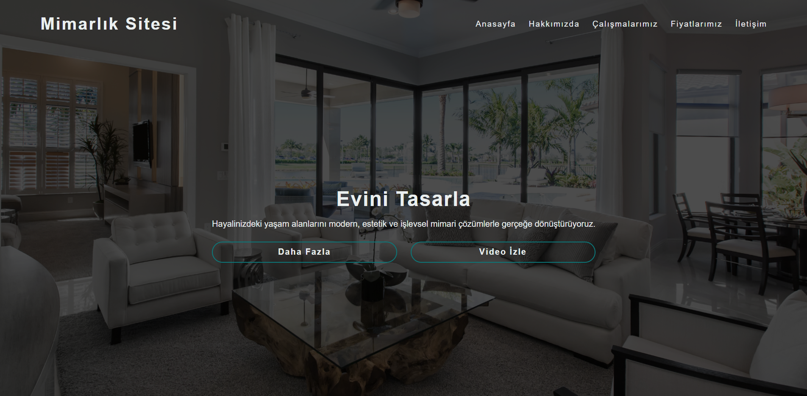

# Mimarlik Sitesi

Modern ve sade bir görünüme sahip, HTML ve CSS ile geliştirilmiş tek sayfalık bir mimarlık tanıtım sitesi.

## Proje Hakkinda

Bu proje, mimarlık ofisi veya kişisel portfolyo sunumu için hazırlanmış basit bir landing page çalışmasıdır. Ana odak noktası; etkileyici bir arka plan görseli, temiz bir navigasyon alanı, dikkat çeken başlıklar ve çagırıcı butonlar ile kullanıcıya güçlü bir ilk izlenim vermektir.

## Ozellikler

- Responsive tasarım
- Tam ekran arka plan görseli
- Modern navigasyon alanı
- Hover efektleri
- Sade ve okunabilir arayüz

## Kullanilan Teknolojiler

- HTML5
- CSS3

## Dosya Yapisi

```text
Mimarlık-Sitesi/
|- index.html
|- style.css
`- img/
   `- background.png
     `- Proje-Görüntüsü.png 
```

## Kurulum ve Calistirma

1. Bu projeyi bilgisayarına indir veya klonla.
2. `index.html` dosyasını tarayıcıda aç.

Ek bir kütüphane veya kurulum gerektirmez.

## Gelistirme Fikirleri

- Menü bağlantılarını gerçek bölümlere veya sayfalara bağlama
- Hakkımızda, projeler ve iletişim bölümleri ekleme
- Butonlara işlev kazandırma
- Görselleri optimize ederek performansı artirma

## Ekran Goruntusu
```md

```

## Lisans

Bu proje öğrenme, geliştirme ve portfolyo amaçli kullanılabilir.
